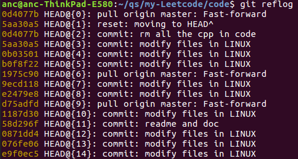

# git使用总结

**描述**：在github上新建了一个仓库，然后主要在win下写文档并推送。另外想要在Linux下面获取远程最新的版本，继续编写，也推送到github。这样就需要解决两地同时使用的问题；（之前一直想做但是没有完成的事情）

- win下本地新建仓库：
	- git initgit 
	- add somefiles
	- git commit -m "comments"
	- git remote add origin YOUR_RES_ADDREgit push -u origin master （以后的push操作不需要加 -u）
  
- Linux下面clone这个仓库，修改之后再提交
	- git clone HTTPS_ADDRESS
	- git add somefiles
	- git commit -m "comments"
	- git config --global user.email "YOUR-EMAIL"
	- git config --global user.name "YOUR-NAME"
	- 因为第一次使用这个Linux系统推送文件到远程仓库，因此需要上面两个命令配置我的信息。

- 解决每次push操作都需要输入用户名和密码修改为ssh方式提交代码
	- git remote rm origin  删除原来的https链接
	- git remote add origin SSH-KEY  添加SSH链接

- 第一次使用某个电脑向github推送文件的时候，如果使用的https方式，那么每次可能都需要输入用户名和密码。如果选用SSH方式，那么需要把这个电脑的SSH添加到github上面。
	- Linux下面具体在 ~./ssh文件夹中

- 以后每次在win下或者Linux下面准备修改本地文件，准备提交之前，首先拉取一下仓库的最新版本，然后再进行修改。
	- git fetch origin master  下载远程master分支最新版本到本地master分支
	- git log -p master..origin/master  比较本地master分支和远程master分支的差别
	- git merge origin/master  合并到本地上述三个命令可以用下面一个替代
	- git pull origin master

- 其他辅助命令
	- git log  查看git提交历史
	- git log --graph --all  树图的形式查看git提交历史
	- git status  查看当前git 状态

- 如果本地版本和github上面的版本没有保持同步的情况下，我们又在本地做了修改怎么办？

没有关系。在没有及时pull最新版本到本地之前，可以任意在本地进行文档的修改。
当你本地修改完成后，这时是不能push的，需要先fetch下来，然后查看对比本地与github仓库中的区别，然后在进行merge操作。这时，git会将github中的最新版同步到本地，并保持本地的修改不变，然后就可以进行push操作了。

- 本地删除了某个文件怎么办？
可以直接通过 ``git rm`` 删除文件。然后再push。这时本地和github中的文件都会被删除。如果此时通过另一个终端（比如我在win下面删除之后，再在Linux下面操作）进行pull操作后，另一个终端本地下的文件也会同步的被删除。

- 同时删除本地仓库和远程仓库的文件夹
   正常直接在本地删除文件夹，然后正常add、commit、push就可以。

- 删除远程仓库的文件夹，保留本地
```git
git pull origin master
git rm -r --cached file-NAME // cached选项不会把本地文件夹删除
git commit ...
git push...
```

- 如果在本地错误进行了`git rm`操作，并且已经commit、push到远程仓库的情况下，想要撤销该操作怎么办？（该操作也适用于错误使用`git pull`之后想要回退）
	- 首先在本地`git reflog` 查看历史变更记录，见下图
	- 
	- 确定自己需要回退到的那一个版本的版本号之后，比如我的5aa30a5版本后，执行`git reset --hard 5aa30a5`即可
	- 如果仅仅是回退到上一个版本，也就是回到上一次commit之后的状态，也可以使用另一个命令：`git reset --hard HEAD^`
		- `--hard`：删除工作空间改动代码，撤销commit，撤销git add 
		- `--soft`：不删除工作空间改动代码，撤销commit，不撤销git add
		- `HEAD^^^`：后面的heat符号个数可以使用`HEAD～n`替代，表示回退到上n个版本
	- 注意这个时候**本地的版本已经落后远程仓库的版本**了，直接进行push操作的话，是无法成功的。因为我主要想回退到上一个版本，因此需要强制远程仓库与本地版本保持一致，push的时候需要加上`-f`参数，也就是`git push -f origin master`

- **tag**
用在给仓库历史中的某一个提交打上标签，以示重要。一般人们使用这个功能来标记发布节点（v1.0, v2.0）等。
    - 列出标签: `git tag`，列出当前分支的所有tag？
    - 创建标签
        - 附注标签: `git tag -a v1.0 -m "msg of tag"`
        - 轻量标签: `git tag v1.4`
    - 共享标签（推送到远程），这有点类似于共享远程分支。
        - 推送特定的某一个标签: `git push origin v1.4`
        - 推送所有标签: `git push origin --tags`
    - 删除标签 
        - 本地删除: `git tag -d v1.4`
        - 远程删除: `git push origin --delete v1.4`


一般我们克隆一个项目下来之后，可能需要根据原开发者发布的tag，比如v1.0, v2.0等，在某一个tag的基础之上创建新的开发分支，然后进行自己的开发。
- 创建分支：`git branch new_branch_name tag`
- 切换到分支：`git checkout new_branch_name`
- 提交分支到远程仓库：`git push origin new_branch_name`


- `tag` 与 `branch` 的区别
	- tag 是某一次commit的标签，是为了发布某一个版本用的。
	- branch 是新建的一条开发分支，他是一个由n多个commit组成的时间线。


- 参考资料
	- [Pro Git(中文版)](https://gitee.com/progit/)
	- [Git教程——廖雪峰的官方网站](https://www.liaoxuefeng.com/wiki/896043488029600)
