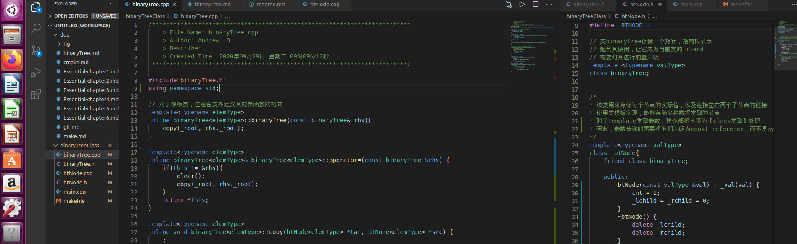

# My Coding Wiki :earth_africa:

> It is not bad to learn from others, but you must remove the parts which are useless or may have bad effects on you; while change and forge good parts and make them into your own.                             ————(America) Zhenning Yang 

### Environment set up & Books

#### Environment :computer:
- Ubuntu 16.04 + Visual Studio Code （使用vs code仅仅编写代码，编译还是在终端下面使用makefile）
    - [vs code 下载到本地](https://code.visualstudio.com/Download)
    - 解压： `sudo dpkg -i your-.deb-file-name`
    - 然后就可以直接在Ubuntu中搜索到vs code

- [一个很好用的vim插件](https://github.com/luckxiang/vim) （熟悉基本的vim操作）

#### Books :books:
- [<Essential C++>]( http://www.broadview.com.cn/book/4437 )  --Stanley B. Lippman

---

### Problem in Leetcode :trophy:

*Talk is cheap, show me the code   ————Linus Torvalds*

- [直接循环求两数之和](code/LC/twoNumSum.cpp)
- [无重复字符最长子串](code/LC/repetitionChar.cpp)
- [整数反转（取值法）](code/LC/reverseINT.cpp)
- [判断回文数（对称取值）](code/LC/ispali.cpp)
- [两数相加（链表实现），输出正序逆序链表](code/LC/singleListNode.cpp)
- [罗马数字转整数](code/LC/roma2Int.cpp)
- [最长公共前缀（表格法）](code/LC/longestPrefix.cpp)
- [DP-最长回文子串](code/LC/longSubPali.cpp)
- [DP-最长非降子序列LIS问题](code/LC/LIS.cpp)
- [双指针法解三数之和](code/LC/threeSum.cpp)
- [合法括号检测](code/LC/validBrackets.cpp)

---

### Algorithm in C++ :tada:

*Bad programmers worry about the code. Good programmers worry about data structures and their relationships.  ————Linus Torvalds*

- [记录遇到的一些问题](./code/sortAlgorithm/question.md)
- [几个排序算法的实现](./code/sortAlgorithm/)
- [二叉树](./doc/Essential-chapter6.md)

---

### <Essential C++> study notes :books:

*Most good programmers do programming not because they expect to get paid or get adulation by the public, but because it is fun to program   ————Linus Torvalds*

- [<Essential C++> Chapter 1](./doc/Essential-chapter1.md)——c++编程基础
    - c++简介
    - 一些对象的定义与初始化
    - 指针带来的弹性

- [<Essential C++> Chapter 2](./doc/Essential-chapter2.md)——面向过程的编程风格
    - 函数参数传递方式
    - 指针与引用
    - 动态内存管理new 与 delete
    - inline、重载、模板函数
    - 函数指针

- [<Essential C++> Chapter 3](./doc/Essential-chapter3.md)——泛型编程风格
    - 泛型的概念
    - 泛型指针--iterator
    - 使用、设计泛型算法
    - map 与 set

- [<Essential C++> Chapter 4](./doc/Essential-chapter4.md)——基于对象的编程风格
    - 实现一个class、成员初始化方法
    - 拷贝构造函数
    - this指针
    - 静态数据/函数成员
    - 迭代类的实现（通过运算符重载）
    - 函数对象
    - 类成员函数指针

- [<Essential C++> Chapter 5](./doc/Essential-chapter5.md)——面向对象的编程风格
    - OOP介绍
    - 抽象基类与派生类
    - 虚函数与纯虚函数
    - 运行时鉴定机制（RTTI）

- [<Essential C++> chapter 6](./doc/Essential-chapter6.md)——以template进行编程
    - 实现一个二叉树的类模板（class template）
    - 函数模板实现output运算符
    - 常量表达式作为模板参数
    - 成员模板函数

- [<Essential C++> chapter 7](./doc/Essential-chapter7.md)——异常处理
    - 抛出异常
    - 局部资源管理
    - 标准异常
---

### Code test in <Essential C++> :rocket:
- [函数参数传递方式&模板函数实现冒泡排序](code/essential/callFunction.cpp)
- [Fibonicca函数中使用静态对象，避免重复计算](code/essential/fibonacci.cpp)
- [使用函数指针调用不同的数列函数](code/essential/functionPoint.cpp)
- [泛型函数的实现](code/essential/genericVector.cpp)
- [使用泛型算法](code/essential/useAlgorithm.cpp)
- [this指针的使用](code/essential/this.cpp)
- [重载运算符详细实现迭代类](code/operatorOverload/)
- [函数对象的实现与应用](code/essential/functionCall.cpp)
- [抽象类的建立与使用](code/abstractClass)
- [类模板实现二叉树，分文件实现](code/binaryTreeClass/)
- [类模板实现二叉树，在一个文件中实现](code/binaryTreeClass/binaryAll.cpp)
- [成员模板函数实现](code/essential/member_template_function.cpp)
- [异常处理](code/essential/exception.cpp)

---

### Use git :bicyclist:
- [git使用总结](doc/git.md)

---

### Use Make & CMake :alarm_clock:
- [两个例子学习Makefile](./doc/make.md)
- [进阶CMake](./doc/cmake.md)

---

### Learn project from open source :couple:

*Intelligence is the ability to avoid doing work, yet getting the work done.
----Linus Torvalds*

> 笔者比较喜欢玩2048这个小游戏，因此想要模仿下面两个很好的开源项目，亲手实现一遍终端版的2048。然后计划使用第二个开源项目中提到的蒙特卡洛法，在终端版2048的基础上实现 AI 版的2048。

- [终端版2048](https://github.com/plibither8/2048.cpp)
- [蒙特卡洛法辅助通关2048](https://github.com/xtrp/jupiter)
